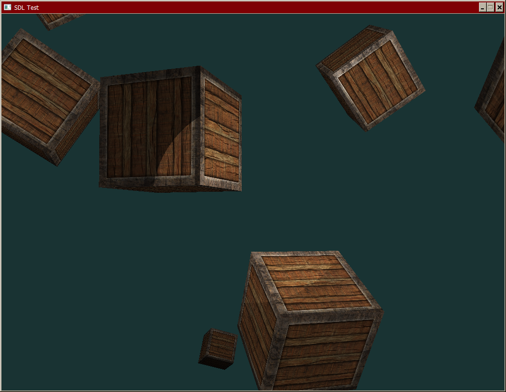

# csharp-sdl-opengl-starter

Minimal csharp + sdl + modern opengl starter project based on common tutorials and Casey Muratori's game loop.

FPS camera and movement with basic lighting and texture shaders.

## basic architecture

http://cinera-mobile.miblodelcarpio.co.uk/hero/code/day026/
(direct: https://www.youtube.com/watch?time_continue=4159&v=rPJfadFSCyQ&feature=emb_title)

42:00 - 48:00 : update and render should not be separate
render is a bad name, is actually more like render-prep

1. input
2. update+render (& sound)

## gameloop

http://cinera-mobile.miblodelcarpio.co.uk/hero/code/day018/

18:00 : fixed framerate game loop design

lots of sound stuff to worry about actually

32:10 : start implementing loop